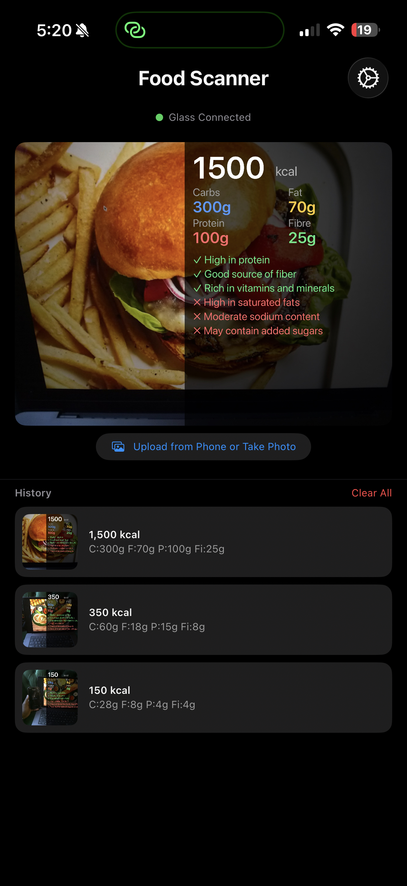
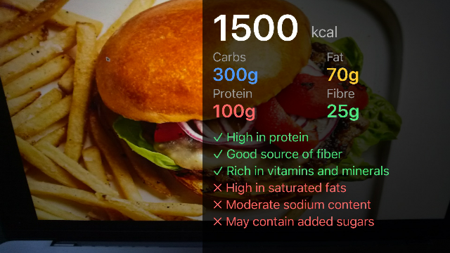
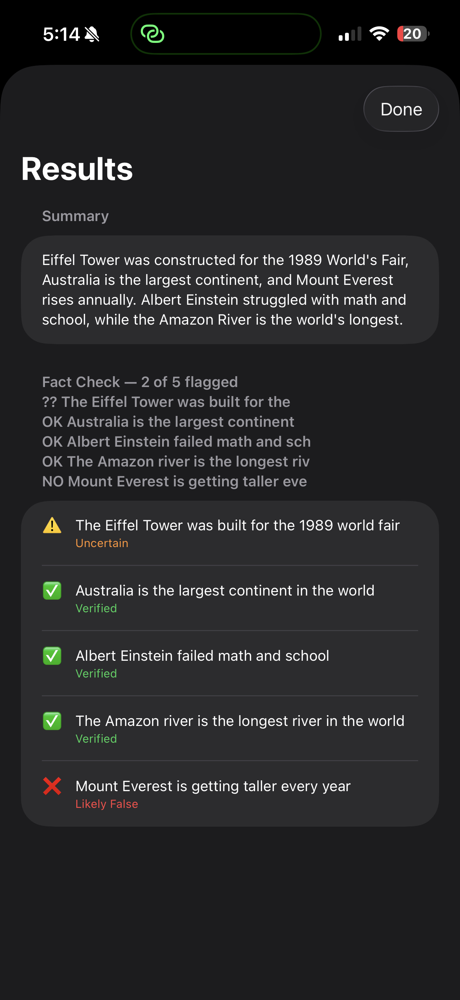
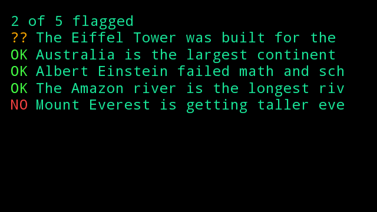

# Scaling Human Experiments

Personal Hardware + AI experiments exploring how machines can extend human
perception, memory, judgment, and capability.

> Human + Machines >> Human | Machines

Created and maintained by
[Srikantha Ballani (@c0smicdirt)](https://github.com/c0smicdirt) as part of
[Scaling Human](https://github.com/scalinghuman).

## Google Glass Explorer Edition Companions

This repository contains Android companion apps for Google Glass Explorer
Edition, referred to here as **Google Glass XE**.

- **Food Scanner for Google Glass XE** captures a food image and sends it to
  the companion iPhone app for nutrition analysis, then displays the result on
  the Google Glass XE prism.
- **Glasshole for Google Glass XE** is an AI-powered conversation fact-checker.
  It starts and stops real-time conversation capture and displays summaries and
  fact-check overlays returned by the companion iPhone app after analysis.

The free iPhone apps are distributed separately through the Apple App Store.
The iPhone apps also support standalone operation without Google Glass XE.

## Repository Contents

```text
companions/
  foodscanner-glass-companion/
  glasshole-glass-companion/
docs/glass/
assets/images/
scripts/
```

The private iOS source, App Store submission materials, research papers, and
internal development notes are not published in this repository.

## Supported AI Providers

The iPhone apps let the user choose the processing provider:

- **Glasshole:** Apple Intelligence, xAI Grok, OpenAI, Anthropic Claude, Google
  Gemini, Ollama, PocketPal, or a custom OpenAI-compatible endpoint.
- **Food Scanner:** Local iPhone Vision, OpenAI, Anthropic Claude, Google
  Gemini/Gemma, Ollama vision models, PocketPal, or a custom endpoint.

Apple Intelligence in Glasshole requires an iPhone 15 Pro model or an iPhone 16
model or later, with Apple Intelligence enabled. Other supported iOS 26 iPhones
must use a configured cloud, local-network, PocketPal, or custom provider.
Food Scanner's default Local iPhone Vision mode works without Apple
Intelligence or an API key.

Get API keys or local runtimes:

- [xAI Grok](https://console.x.ai/)
- [OpenAI](https://platform.openai.com/api-keys)
- [Anthropic Claude](https://platform.claude.com/settings/keys)
- [Google Gemini](https://aistudio.google.com/app/apikey)
- [Ollama](https://ollama.com/download) (no API key)

## Install

See [Google Glass XE Installation Guide](docs/glass/GLASS_INSTALL_GUIDE.md) for
ADB installation, networking, and voice-command setup.

The Google Glass XE companions target Android 4.4.4 / API 19 and are sideloaded.
Google Glass Explorer Edition is discontinued hardware and is not manufactured
or supported by Google.

## Screenshots

### Food Scanner





### Glasshole





## Status

Experimental. AI nutrition estimates and fact-check results can be wrong and must
not be treated as medical advice or authoritative fact.

Source is available under the
[Scaling Human Source-Available License](LICENSE). Redistribution, commercial
use, hosted derivatives, and app-store publication require written permission.
